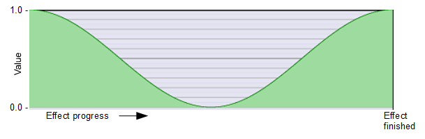
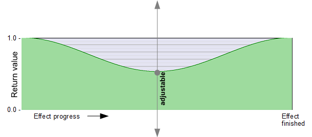

# Using Lightworks special auto-synced parameters

## [Available variables](../Basics/Variables_etc/Auto_synced/README.md)  
   *(The available variables, which Lightworks automatically updates with the project, can be found in chapter "Basics".)*

---

## Calculation of more values based on these variables::

### Calculation of the project frame rate
This macro `PROJECTfps` calculates the actual frame rate of the project.
This may differ from the automatically synchronized variable `float _OutputFPS`, which passes the framerate set in the project settings "Video / Output / Format".  
*Global for the entire effect (add outside and above all shaders and functions):*
```` Code
//--------------------------------------------------------------//
// Definitions, declarations und macros
//--------------------------------------------------------------//

float _Length;
float _LengthFrames; 

#define PROJECTfps   (_LengthFrames / _Length)
````


---


### Relative position in effect progress

### _Progress   
   
Ramp from value 0 to 1 over the duration of the effect.  
*Global for the entire effect (add outside and above all shaders and functions):*
```` Code
//--------------------------------------------------------------//
// Definitions and declarations
//--------------------------------------------------------------//

float _Progress;
````  

Often it can be more useful to [create this ramp using keyframing.](../Basics/Variables_etc/Auto_synced/_Progress.md)


--- 
 
### progressCos1_0_1  
  
Three-point progress: 1 .. 0 .. 1  
*Required global variable declaration and definition (add outside and above all shaders and functions):*
```` Code
//--------------------------------------------------------------//
// Definitions and declarations
//--------------------------------------------------------------//

#define TWO_PI  6.2831853072
float _Progress;
````
*Local (within shaders or functions):*
```` Code
float progressCos1_0_1 = cos(_Progress * TWO_PI) * 0.5 + 0.5;
````

Often, it may be better to use another variable instead of `float _Progress`, whose ramp is [generated by keyframing.](../Basics/Variables_etc/Auto_synced/_Progress.md)


--- 
 
### progressCos1_Y_1  
  
Three-point progress: 1 ...  adjustable central value  ... 1  
*Required global variable declaration and definition (add outside and above all shaders and functions):*
```` Code
//--------------------------------------------------------------//
// Definitions, declarations und macros
//--------------------------------------------------------------//

#define TWO_PI  6.2831853072
float _Progress;
````
*Function:*
```` Code
float fn_progressCos1_Y_1 (float centralValue)
{
   float progressCos1_0_1 = cos(_Progress * TWO_PI) * 0.5 + 0.5;
   return progressCos1_0_1 * (1.0 - centralValue) + centralValue;
}
````

Often, it may be better to use another variable instead of `float _Progress`, whose ramp is [generated by keyframing.](../Basics/Variables_etc/Auto_synced/_Progress.md)
