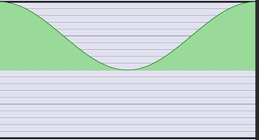

# Using Lightworks special auto-synced parameters

## [Available variables](../Basics/Variables_etc/Auto_synced/README.md)  
   *(The available variables, which Lightworks automatically updates with the project, can be found in chapter "Basics".)*

---

## Calculation of more values based on these variables::

### Calculation of the project frame rate
This macro `PROJECTfps` calculates the actual frame rate of the project.
This may differ from the automatically synchronized variable `float _OutputFPS`, which passes the framerate set in the project settings "Video / Output / Format".  

```` Code
//--------------------------------------------------------------//
// Definitions, declarations und macros
//--------------------------------------------------------------//

float _Length;
float _LengthFrames; 

#define PROJECTfps   (_LengthFrames / _Length)
````


---


### Relative position in effect progress


--- 
 
### progressCos1_0_1   
Three-point progress: 1 .. 0 .. 1 

```` Code
#define TWO_PI  6.2831853072
float _Progress;
float progressCos1_0_1 = cos(_Progress * TWO_PI) * 0.5 + 0.5;
````
