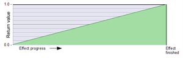
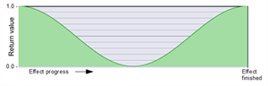

# Relative position in effect progress

## [_Progress](images/thumbnails/_Progress.png)
  

-    
Ramp from value 0 to 1 over the duration of the effect.  

 
## progressCos1_0_1  
  
Three-point progress: 1 .. 0 .. 1  

 
## progressCos1_Y_1  
  
Three-point progress: 1 ...  adjustable central value  ... 1  
