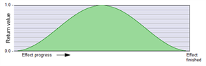
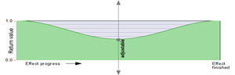

# Relative position in effect progress
## Defauld:

### [_Progress](_Progress.md)  
The **default** ramp from value 0 to 1 over the duration of the effect.  
 
  
---
---
  
# Generation of other characteristics from this ramp
  
## S-Curves

|              [progress_S](progress_S.md)                |             [progress2xS](progress2xS.md)                  |
|:-------------------------------------------------------:|:----------------------------------------------------------:|
|            **S-Curve**, 0 to 1                          |   **S-Curve**, 0 to 1  ,  Double use of cosine waves.      |
|   |    |

---

  
## Three-point cosine curves, two directions of movement of the return value

Fixed value **0.0** at the **start** and at the **end**: 

|       [progressCos0_1_0](progressCos0_1_0.md)               |         [progressCos0_Y_0](progressCos0_Y_0.md)              |
|:-----------------------------------------------------------:|:------------------------------------------------------------:|
|        Three-point progress: 0 .. 1 .. 0                    | Three-point progress: 0 ...  adjustable central value  ... 0 |
|  |   |

---

Fixed value **1.0** at the **start** and at the **end**:

|        [progressCos1_0_1](progressCos1_0_1.md)              |             [progressCos1_Y_1](progressCos1_Y_1.md)           |
|:-----------------------------------------------------------:|:-------------------------------------------------------------:|
|             Three-point progress: 1 .. 0 .. 1               | Three-point progress: 1 ...  adjustable central value  ... 1  |
|  |    |

