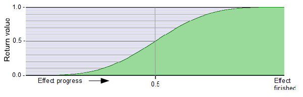

# progress2xS  
  

**S-Curve**  
Double use of cosine waves to speed up the associated effect processes around the middle of the effect time.
  
*Required global variable declaration and definition (add outside and above all shaders and functions):*
```` Code
//--------------------------------------------------------------//
// Definitions and declarations
//--------------------------------------------------------------//

#define PI      3.1415926536
float _Progress;
````  
  
### Local Code (within shaders or functions):  
```` Code
float progress_S = cos(_Progress * PI) *-0.5 + 0.5;
float progress2xS = cos(progress_S * PI) *-0.5 + 0.5;
````
**Note:** Often, it may be better to use another variable instead of `float _Progress`, whose ramp is [generated by keyframing.](../../Basics/Variables_etc/Auto_synced/_Progress.md)

---

### Parameter Description:
1. `_Progress` [Documentation](_Progress.md)  
2. `progress_S` (standard cosine S-curve) [Documentation](progress_S.md)

---

### Alternative code: 

#### Shortened by one variable:
```` Code
float progress2xS = cos( PI
                       * (cos(_Progress * PI) *-0.5 + 0.5)
                       ) *-0.5 + 0.5;
````

#### Or just one line:

```` Code
float progress2xS = cos( PI * (cos(_Progress * PI) *-0.5 + 0.5) ) *-0.5 + 0.5;
````
