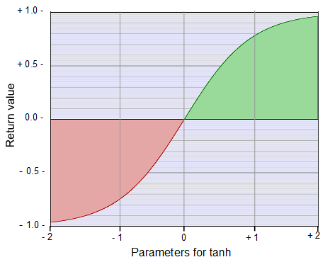

# tanh ()

See **page 759** in the PDF document: [Nvidia's Cg reference manual, starting on page 685](https://www.google.com.au/url?sa=t&rct=j&q=&esrc=s&source=web&cd=3&cad=rja&uact=8&ved=0ahUKEwj5qpif6rHTAhXLF5QKHQ6MCeAQFggwMAI&url=http%3A%2F%2Fdeveloper.download.nvidia.com%2Fcg%2FCg_3.1%2FCg-3.1_April2012_ReferenceManual.pdf&usg=AFQjCNHI5gaVpuvJH6ZO8bnX7BxJGKXr0A)

  - #### Mathematical basics: https://en.wikipedia.org/wiki/Hyperbolic_function#Tanh  
  
  - #### Example of return values of tanh when using a ramp from -2 to +2 for the parameter:  
   

  - #### [Video](video/tanh.mp4) of the tanh return characteristic with different linear parameter ramps.
