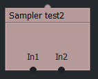

An example of a test effect:
``` Code
//--------------------------------------------------------------//
// Inputs
//--------------------------------------------------------------//

texture In1;
texture In2;

texture OutputFromPassOne : RenderColorTarget;  
```

The result for the effect "Sampler test2" then looks as follows:  


"texture OutputFromPassOne" ... is not visible in the routing because the video signal (texture) comes from a pixel shader within it effect.
 This is set by ": RenderColorTarget".
 From which pixel shader this internal texture comes, we programmed in the "Techniques" section.


### Pixel color:
  - In order for the pixel shader to read the pixel colors of the three textures, we have to create the corresponding samplers (see the "Samplers" section).


### Texture coordinates (Update versions from 2021) :
  - The effect inputs also provide texture coordinates needed by the pixel shader to determine the position of the pixels:
    - **TEXCOORD1** (1st input)
    - **TEXCOORD2** (from the 2nd input, or in case of 1 input, the coordinates of an internally rendered texture if available)
    - **TEXCOORD3** (from the 3nd input, or in case of 2 input, the coordinates of an internally rendered texture if available)
    - **TEXCOORD4** (from the 4nd input, or in case of 3 input, the coordinates of an internally rendered texture if available)
    - **TEXCOORD5** (from the 5nd input, or in case of 4 input, the coordinates of an internally rendered texture if available)
    - **TEXCOORD6** (from the 6nd input, or in case of 5 input, the coordinates of an internally rendered texture if available)
    - **TEXCOORD7** (In case of 6 input, the coordinates of an internally rendered texture if available)  
More texture coordinates are not supported.

Note: Regarding the order of numbering the texture coordinates, the order of the real inputs is relevant.  Example:

``` Code
//--------------------------------------------------------------//
// Inputs
//--------------------------------------------------------------//

texture In1;                                    // Imput1 (TEXCOORD1)
texture OutputFromPassOne : RenderColorTarget;  // internally rendered texture (TEXCOORD3)
texture In2;                                    // Imput2 (TEXCOORD2)
```

Note: Texture coordinates coming directly from internally rendered textures are not available in Lightworks versions prior to 2021.


## New in Lightworks 14.5:

Great White wrote:
> I've added some experimental support in the latest beta which allows you to refer to image files directly  
> from within Lightworks pixels-shader effect files. For example, you can now write something like :

``` Code
texture _Grain < string Resource = "FilmGrain.png"; >;
```

Great White wrote:
> Which will cause the '_Grain' texture to be initialised with image-data in FilmGrain.png. 
>
> The texture variable name should start with a leading underscore to prevent it from being identified as an effect input,  
> and the specified image should be located in the same folder as the .fx file ...


More details and tests see on / from [lwks.com page 15 starting with Post # 170010.](https://www.lwks.com/index.php?option=com_kunena&func=view&catid=7&id=143678&limit=15&limitstart=210&Itemid=81#170010)

