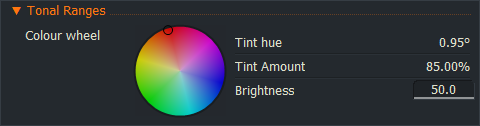

# Colour parameters

### Colour picker: 
``` Code
float4 TLColour
<
   string Description = "Top Left";
   bool SupportsAlpha = true;
> = { 1.0, 0.0, 0.0, 1.0 };
```  
You can use either standard brackets in that parameter to give you ( 1.0, 0.0, 0.0, 1.0 ) or curly brackets as shown above.  
If you use the standard brackets the colour shown will default to white,  
regardless of any values that you may have set in your code.

---  
  
### Colour wheel:
You can make colour params be represented using a colour wheel by adding the annotation "SpecifiesColourOffset";  
For example:
``` Code
float4 MidTintColour
<
   string Description = "Midtones";
   string Group       = "Tonal Ranges";
   string Flags       = "SpecifiesColourOffset";
> = ( 1.0, 1.0, 1.0, 1.0 );
```

 **Additional information:** the colour wheel doesn't return simple RGB values when you use that switch.
The brightness setting ranges from 50% to 159%, but doesn't seem to permit ever reaching white.  
Maybe for user effects the standard color wheel in the color picker is better suited?

--- 
  
#  Specifies Colour Range:
``` Code
// ...
string Flags   =  "SpecifiesColourRange";
// ...
```
  
You will find an example of its use in the Editshare chromakey sample code.
