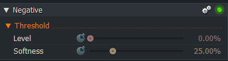

# Scalar parameter

First, a default code from the "negative.fx" effect, as used in the introduction on [redsharknews.com](https://www.redsharknews.com/technology/item/221-how-to-write-video-effects-for-lightworks)
``` Code
float Level
<
   string Description = "Level";
   string Group = "Threshold";
   float MinVal = 0.0;
   float MaxVal = 1.0;
> = 0.0;

float Softness
<
   string Description = "Softness";
   string Group = "Threshold";
   float MinVal = 0.0;
   float MaxVal = 1.0;
> = 0.25;
```


### The result:


---

``` Code
``` 


