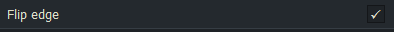
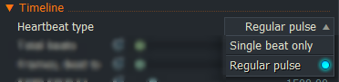

# Scalar parameter

First, a **default code** from the "negative.fx" effect, as used in the introduction on [redsharknews.com](https://www.redsharknews.com/technology/item/221-how-to-write-video-effects-for-lightworks)
``` Code
float Level
<
   string Description = "Level";
   string Group = "Threshold";
   float MinVal = 0.0;
   float MaxVal = 1.0;
> = 0.0;

float Softness
<
   string Description = "Softness";
   string Group = "Threshold";
   float MinVal = 0.0;
   float MaxVal = 1.0;
> = 0.25;
```


### The result:


---------------------------------------------------------------------------------------------------------------------------
---------------------------------------------------------------------------------------------------------------------------


### Automatic keyframes at the start and end position of the effect (`KF0`and `KF1`):

``` Code
float Amount
<
   string Description = "Amount";
   float MinVal = 0.0;
   float MaxVal = 1.0;
   float KF0    = 0.0;
   float KF1    = 1.0;
> = 0.5;
``` 

---------------------------------------------------------------------------------------------------------------------------
---------------------------------------------------------------------------------------------------------------------------


### Flags

  - ### Parameter influence via moving mouse position on the viewer:
    `string Flags = "SpecifiesPointX";` and 
    `string Flags = "SpecifiesPointY";` and
     optional: `string Flags = "SpecifiesPointZ";`
     
     ``` Code
     float CentreX
     <
        string Description = "Origin";
        string Flags = "SpecifiesPointX";
        float MinVal = 0.00;
        float MaxVal = 1.00;
     > = 0.5;
     
     float CentreY
     <
        string Description = "Origin";
       string Flags = "SpecifiesPointY";
        float MinVal = 0.00;
        float MaxVal = 1.00;
     > = 0.5;
     ``` 
     
     **Additional information:** when using "SpecifiesPointY" it may be necessary to invert the sense of the value returned.
       In the example above float Centre_Y = 1.0 - CentreY will do that.
       You then use Centre_Y in your code instead of CentreY.  
       There's also a third parameter in this group, "SpecifiesPointZ". 
       To see that being used look at the position parameters in the 3D DVE effect.  
       
       ..................................................................................................................
 


  - ### New optional fags starting from Lightworks 2020.1
     #### Define whether the slider values should be displayed in percent:  
      `string Flags = "DisplayAsPercentage";`  
      [**Example** code see developer's post.](https://www.lwks.com/index.php?option=com_kunena&func=view&catid=7&id=169103&Itemid=81#189225)  
      
    If the value should not be displayed in percent:  
      `string Flags = "DisplayAsLiteral";` 
      
    **Additional information:**  
      If these flags are not used, Lightworks will automatically decide, based on the setting range, 
      whether the values are displayed as percentage.  
      Lightworks 14 ignores these two flags.  
      In order for these two flags to be taken into account, the effect must be installed with Lightworks versions starting from 2020,         and must also be adjusted with these versions.  
      

- ### [General notes from the developer:](https://www.lwks.com/index.php?option=com_kunena&func=view&catid=7&id=169103&Itemid=81#189225)
  > If your parameter already has other flags, you can concatenate them like so :  
  > `string Flags = "SpecifiesPointY|DisplayAsPercentage";`

---------------------------------------------------------------------------------------------------------------------------
---------------------------------------------------------------------------------------------------------------------------
  
  
  
  
### Example with boolean variable for program control (true / false):
  
``` Code
bool Flip_edge
<
string Description = "Flip edge";
> = true;
  ```

  
  

---------------------------------------------------------------------------------------------------------------------------
---------------------------------------------------------------------------------------------------------------------------


### Example with integer variables for program control:
 ``` Code
 int enable_cycles
<
   string Group = "Timeline";
   string Description = "Heartbeat type";
   string Enum = "Single beat only,Regular pulse";
> = 1;
 ```
That will show you "Heartbeat type" on the left of the settings window, and either "Single beat only" or "Regular pulse" (the default setting) on the right. The first enumerated parameter evaluates as 0, the second as 1.  
  
*(Note that complex code can be more efficient to use different pixel shaders for different functions (see "[Select Technique](Select_Technique.md)")*

 
