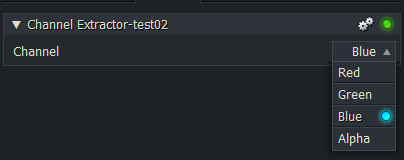

# Select Technique

Quote from the effect: "Channel Extractor" (filename: Sample 4 - Single input, Multi technique.fx) :
> If Lightworks encounters a parameter called 'SetTechnique', it will be shown on the FX panel like any other parameter,  
> but it will also implicitly choose an execution technique to match the user-selection  
> (eg. if the user chooses 'Green' from the drop-down list,  
> Lightworks will arrange for the 'Green' technique to execute when the effect is rendered.
``` Code
int SetTechnique
<
   string Description = "Channel";
   string Enum = "Red,Green,Blue,Alpha"; 
> = 0;
```
The Enum parameter allows you to use literal comma-delimited text in your selection menu.  

  
  
**Example with a different setting:**
``` Code
int SetTechnique
<
   string Description = "Channel";
   string Enum = "Red,Green,Blue,Alpha";
> = 2;    // Use this to set the default technique.
```

