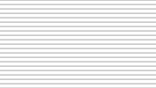
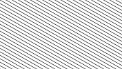

# Lines

### Vertical lines over the entire frame.
  - [multilines_total_V](multilines_total_V.md)  
     Generating a selectable number of vertical lines of equal distance across the entire frame.  
     The macro itself performs something similar to pixel interpolation on the edges of the lines.  
       
   
   
   - Angle adjustable
      - [multilines_total_V02](multilines_total_V02.md)  
        Generating a selectable number of vertical or diagonal lines of equal distance across the entire frame.  
        The edge softness of the lines and much more is adjustable.  
          

--- 

### Horizontal lines over the entire frame.
  - [multilines_total_H](multilines_total_H.md)  
     Generating a selectable number of horizontal lines of equal distance across the entire frame.  
     The macro itself performs something similar to pixel interpolation on the edges of the lines.  
       
     
     
   - Angle adjustable
      - [multilines_total_H02](multilines_total_H02.md)  
        Generating a selectable number of horizontal or diagonal lines of equal distance across the entire frame.  
        The edge softness of the lines and much more is adjustable.  
        
