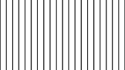

# multilines_total_V         [](images/multilines_total_V.png)

**Function call:** `fn_multilines_total_V (uv, color , bgVariable , lines , half_Lineweight , roll)`  
The image was created with these parameters: `fn_multilines_total_V (uv0, float4(0.4.xxx, 1.0), 1.0.xxxx, 20.0, 0.005, 0.0)`


*or* **Macro call:** `MULTILINES_TOTAL_V (uv, color , bgVariable , lines , half_Lineweight , roll)`  
  ([Macro code](#macro-code) can be found at the bottom of this page)

---

***Purpose of the macro:***  
Generating a selectable number of **vertical lines** of equal distance across the **entire frame**.  
The **background texture** is added with the `bgVariable`.  
This can be a color, or a texture from a sampler.  
The macro itself performs something similar to **pixel interpolation on the edges of the lines**.  
(1 subtexel horizontal edge softness of the lines)  
More functions and details see the parameter descriptions  

---

### Environment requirements

#### Global variable:  `float _OutputWidth`

#### Code (Example as a function):
```` Code
float4 fn_multilines_total_V (float2 uv, float4 color, float4 bgVariable, 
                              float lines, float half_Lineweight, float roll)
{ 
   float mix = saturate (
      (abs( (uv.x - roll) - (round( (uv.x - roll)  * lines)  / lines ))
      - half_Lineweight
      ) /  (1.0 / _OutputWidth)
   );
  
   return lerp (color, bgVariable, mix);
}
````   
`(1.0 / _OutputWidth)` is the widht of a texel within the output texture.  
This creates the necessary edge softness of the lines.  

---

#### Parameter Description  
  
   1. `uv`:  
     Enter the name of the used texture coordinate variable.  
     **Type: `float2`**  
     Recommendation: float2 uv0 : TEXCOORD0   (which may not be used for sampler parameters!)


---
  
   2. `color`:  
     Color of the line  
     **Type: float4 (RGBA)**  
        - The **macro code** also works with other float types (eg float3 RGB).  
          In any case, it must be the same type as `bgVariable`  
  
---

   3. `bgVariable`:  
     The background texture  
     **Type: float4 (RGBA)**  
        - The **macro code** also works with other float types (eg float3 RGB).  
          In any case, it must be the same type as `color`  
       
---

   4. `lines`:  
     Number of lines  
     **Type: scalar `float`**  
     **Impermissible value:** 0 (would be a division by zero within the macro)

---

   5. `half_Lineweight`:  
     Half line width  
     **Type: scalar `float`**  
       - Usable value range 0.0 to 0.5  
       - Examples:  
         0.0:  Line thickness 1 to 2 pixels  (line thickness + 2 * edge softness)  
         0.005: Line thickness 1% of the frame width  
         0.5:  Line thickness over the entire frame width  
         
---
   
   6. `roll`:  
     - Rolls the lines along the X axi.
     - Rising values rolls all lines to the right, sinking values to the left.
     - **Type: scalar `float`**  
     - Usable value ranges:  
       - To position the first line within the texture: from 0 to 1  
       - Rolling of the lines (keyframing): ~ -1000 to + 1000  
         (if this range is exceeded, the mathematical unrealities can be seen.)  
     - Position of the first line (which is the only one independent of the number of lines): 
       - Value 0.0: The center of this line thickness is at the left edge of the frame. (half of the line is outside the texture)   
       - Value 0.5: This line is centered in the frame.  
       - Value 1.0: Like value 0, (wrapped)  


---

 #### Return value:
   - The value of the parameter `color` (the line)  
     - or the value of the parameter`bgVariable`  
     - or a mix of both (edge-interpolatin of the lines)  
   - **Type: same as `color` and `bgVariable`**    
   - Value range: 0.0 to 1.0  

 
---
---


### Macro code:

```` Code
#define MULTILINES_TOTAL_V(uv,color,bgVariable,lines,half_Lineweight,roll)              \
   lerp ((color), (bgVariable), saturate (                                              \
         (abs( ((uv).x - (roll)) - (round( ((uv).x - (roll))  * (lines))  / (lines) ))  \
         - (half_Lineweight)                                                            \
         ) /  (1.0 / _OutputWidth)                                                      \
   ))
````   

### Screenshot  

