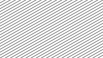
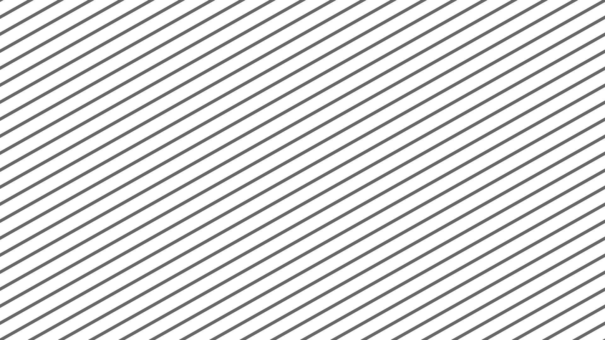

# multilines_total_V02  [](images/multilines_total_V02.png)

**Function call:** `fn_multilines_total_V02 (uv, color, bgVariable, lines, lineweight, soft, angle, roll)`  
Example with values: `fn_multilines_total_V02 (uv0, float4(0.4.xxx, 1.0), 1.0.xxxx, 20.0, 0.005, 9E-4, 0.37, 0.0)`
(Result [see image](images/multilines_total_V02.png))  

*or* **Macro call:** `MULTILINES_TOTAL_V02 (uv, color, bgVariable, lines, lineweight, soft, angle, roll)`  
  ([Macro code](#macro-code) can be found at the bottom of this page)

---

***Purpose of the macro:***  
Generating a selectable number of **lines** of equal distance across the **entire frame**.  
Optimized for **vertical lines**; recommended application range 0 to 45°.  
The **angle** can be changed by shifting the lower end of the lines without changing the position of the upper end of the line.  
The **softness of the line edges** can be adjusted.  
The **background texture** is added with the `bgVariable`.  
This can be a color, or a texture from a sampler.  
More functions and details see the parameter descriptions.


---

### Requirements

#### Global variable:  `float _OutputAspectRatio`

#### Code (Example as a function):
```` Code
float4 fn_multilines_total_V02 (float2 uv, float4 color, float4 bgVariable, float lines,
                                float lineweight, float soft, float angle, float roll)
{ 
   float mix = saturate (
      (abs( (uv.x - (roll + (uv.y / _OutputAspectRatio) * angle))
          - (round( (uv.x  - (roll + (uv.y / _OutputAspectRatio) * angle ))  * lines)  / lines )
          ) - lineweight
      ) / soft
   );
  
   return lerp (color, bgVariable, mix);
}
````   
**Option: Automatic use of minimum edge smoothness for pixel interpolation purposes:**  
You can replace `      ) / soft` with `      ) /  (soft + (1.0 / _OutputWidth))`.  
`(1.0 / _OutputWidth)` is the widht of a texel within the output texture.  
This creates the necessary edge softness of the lines to minimize pixel jumps and aliasing.
(Remember to declare these global variables high up in the code, outside the function.)

---

#### Parameter Description  
  
   1. `uv`:  
     Enter the name of the used texture coordinate variable.  
     **Type: `float2`**  
     Recommendation: float2 uv0 : TEXCOORD0   (which may not be used for sampler parameters!)

---

  
   2. `color`:  
     Color of the line  
     **Type: float4 (RGBA)**  
        - The **macro code** also works with other float types (eg float3 RGB).  
          In any case, it must be the same type as `bgVariable`  
  
---

   3. `bgVariable`:  
     The background texture  
     **Type: float4 (RGBA)**  
        - The **macro code** also works with other float types (eg float3 RGB).  
          In any case, it must be the same type as `color`  
       
---

   4. `lines`:  
   - Number of lines on the top edge of the frame.  
     Depending on the angle settings, additional lines may be visible, starting at the right or left edge.  
     This parameter only takes into account lines touching the top edge of the frame.  
    - *Type:* **scalar** `float`  
    - **Impermissible value:** 0 (would be a division by zero within the macro)  

---

   5. `lineweight`:  
     - Line width  
     - **Type:scalar `float`**  
     - Usable value range 0.0 to 0.5  
     - Examples (vertical lines without edge softness):  
       0.000: Line width 0 pixels  
       0.005: Line width 1% of the frame width  
       0.500: Line width over the entire frame width 
     - If the angle of the lines is not vertical, then the lines move closer together,  
       because additional lines on the left or right edge of the frame fill the vacant areas.  
       The ratio of the line width to the width of the intervening background remains approximately constant. 
       As a result, the line width becomes narrower than the set value.
     - A set edge softness increases the line width.
         
---

   6. `soft`:
     - Edge softness of the lines.  
     - **Type:scalar `float`**  
     - Usable value range ~ 0.0001 to 0.5
     - **Impermissible value:** 0 (would be a division by zero within the macro)  
     - Examples (vertical lines):  
       0.0001: No softness  
       0.005: Softness 1% of the frame width  
     - Softness increases the line width. This can far exceed the set line width.   
     - The maximum softness is achieved when, with the line width parameter set to zero,   
       the width is set only with the softness parameter.  
     - Recommended minimum settings to minimize pixel jumps and aliasing:

  |   720p |  1080p |  UHD  |
  |:------:|:------:|:-----:|
  |  8E-4  |  5E-4  | 3E-4  |

...
  
   6. `soft` **Different requirements** for this parameter when using the **alternative code** `) /  (soft + (1.0 / _OutputWidth))`:  
     - Usable value range 0.0 to 0.5  
     - **Impermissible values:** Negative values (risk of divide by zero within the macro)  
     - A value of 0.0 automatically applies a minimum edge softness of 1 texel (interlaced projects 2 texel).  
       This applies to the 0 ° angle setting. At angles of 45 ° or more, additional edge softness may be required.


---

  7. `angle`:
    - The **angle** can be changed by shifting the lower end of the lines  
      without changing the position of the upper end of the line.  
    - **Type: scalar `float`**  
      0.0 V Vertical lines  
      +1.0 : 45° (lower end of line shifted to the **left**)  
      -1.0 : 45° (lower end of line shifted to the **right**)  
      The adjustment characteristic is not linear.
      0.18 : ~ 10°  
      0.37 : ~ 20°  
      0.58 : ~ 30°  
      0.84 : ~ 40°  
      1.00 : = 45°  
      1.19 : ~ 50°  
      1.74 : ~ 60°  
      2.73 : ~ 70°  
      5.70  : ~ 80°  
      There are no 90 ° adjustable  
      For values well above 45 ° another macro is recommended: (multilines_total_H02)  
    - This parameter also affects the line width.    

---
   
   6. `roll`:  
     - This rolls the lines in the 90 ° direction to the line. 
     - Rising values of `roll` roll all lines to thr right, sinking values to the left (if an angle of 0° is set).
     - **Type: scalar** `float`**  
     - Usable value ranges:  
       - To position the first line within the texture (which is the only one independent of the number of lines): from 0 to 1  
       - Rolling of the lines (keyframing): ~ -1000 to + 1000  
         (if this range is exceeded, the mathematical unrealities can be seen.)  


---

 #### Return value:
   - The value of the parameter `color` (the line)  
      or the value of the parameter`bgVariable`  
      or a mix of both (edge softness)  
   - **Type: same as `color` and `bgVariable`**  
   - *Value range*: 0.0 to 1.0  

 
---
---


### Macro code:

```` Code
#define MULTILINES_TOTAL_V02(uv,color,bgVariable,lines,lineweight,soft,angle,roll)                             \
   lerp (color, bgVariable, saturate  (                                                                        \
         (abs( ((uv).x - ((roll) + ((uv).y / _OutputAspectRatio) * (angle)))                                   \
             - (round( ((uv).x  - ((roll) + ((uv).y / _OutputAspectRatio) * (angle) ))  * (lines))  / (lines) )\
             ) - (lineweight)                                                                                  \
         ) / (soft)                                                                                            \
   ))
````  


### Screenshot  

