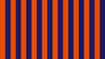

# Patterns

### Line Patterns
  - [linePattern](linePatterns/linePattern.md)  
     Creates a pattern of a selectable number of symmetrical horizontal or vertical lines
     of alternating color or brightness or another RGB source.    
         

  - [linePatternD01](linePatterns/linePatternD01.md)  
     Creates a pattern of a selectable number of symmetrical diagonal 45° lines  
     of alternating color or brightness or another RGB source.   
       

  - [linePatternD02](linePatterns/linePatternD02.md)  
     Creates a pattern of a selectable number of symmetrical diagonal 45° lines  
     of alternating color or brightness or another RGB source.   
       
     
*[Click here for more graphic line code.](../Lines/README.md)*

### Pattern of angular elements

  - [diamondPattern](diamondPattern.md)  
     Generating a selectable number of diamonds with changing color or brightness or other RGB source.     
     Adjustable edge softness of the squares.   
     

  - [checkPatternSoft](checkPattern/checkPatternSoft.md)  
     Generating a selectable number of squares with changing color or brightness or other RGB source.     
     Adjustable edge softness of the squares.   
       

  - [checkPattern](checkPattern/checkPattern.md)  
     Generating a selectable number of squares with changing color or brightness or other RGB source.  
     This is a variant with **simplified code** (excessively sharp edges of squares) that is **not suitable for all purposes!**  
       

