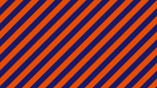

# Patterns

### Line Patterns
  - [linePatternD01](linePatterns/linePatternD01.md)  
     Generating a selectable number of squares with changing color or brightness or other RGB source.    
       
     
  - [linePatternD02](linePatterns/linePatternD02.md)  
     Generating a selectable number of squares with changing color or brightness or other RGB source.    
       
     
*[Click here for more graphic line code.](../Lines/README.md)*

### Check Patterns
  - [checkPattern](checkPattern/checkPattern.md)  
     Generating a selectable number of squares with changing color or brightness or other RGB source.    
       
   
  - [checkPatternSoft](checkPattern/checkPatternSoft.md)  
     Generating a selectable number of of squares with changing color or brightness or other RGB source.     
     Adjustable edge softness of the squares.   
       
