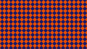
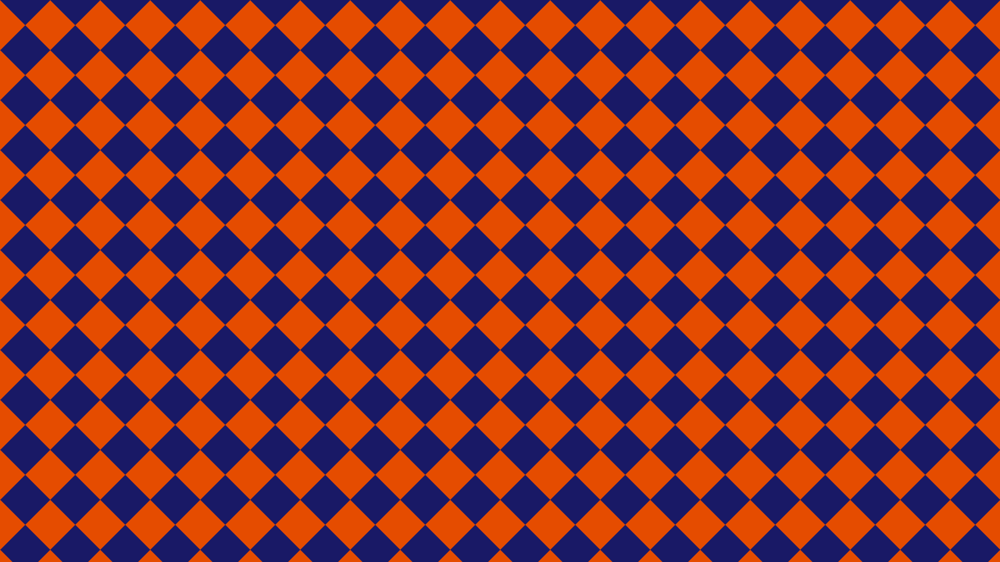

# fn_diamondPattern  [](images/diamondPattern.png)

**Function call:** `fn_diamondPattern (uv, color1, color2, numberH, edgeSharpness);`  

Example with values: `fn_diamondPattern (uv, 0.0.xxx, 1.0.xxx, 20.0, 1000.0);`  
(Result [see image](images/diamondPattern.png))
  
--- 
  
***Purpose:***  
Generating a selectable number of diamonds with changing color or brightness or other RGB source.    
This can be a color, or a texture from a sampler. 
Adjustable edge softness of the squares.   
More details see the parameter descriptions.  

---
    
### Required global definitions and declarations:
*(add outside and above all shaders and functions):*
```` Code
//-----------------------------------------------------------------------------------------//
// Definitions and declarations
//-----------------------------------------------------------------------------------------//

float _OutputAspectRatio;
#define PI  3.141592654
````
---

### Code (Example as a float3 RGB function without alpha):
```` Code
float3 fn_diamondPattern (float2 uv, float3 color1, float3 color2, float numberH, float edgeSharpness)
{ 
  float2 mix = float2 (uv.x + (uv.y / _OutputAspectRatio) , 0.0);
   mix.y = uv.x - (uv.y / _OutputAspectRatio);
   mix = sin (mix * PI * numberH ) * edgeSharpness / numberH;
   mix =  clamp( mix, -0.5, 0.5) + 0.5;
   return lerp (color1, color2, lerp( mix.y , 1.0 - mix.y, mix.x));
}
````   
When making code changes, note that `color1` and `color2` must have the same float type.

[Code description at the bottom of this page.](#code-description)


---
---

### Parameter Description  
  
   1. `uv`:  
     Enter the name of the used texture coordinate variable.  
     **Type: `float2`**  
      

---

  
   2. `color1`:  
     Color of the diamonds.  
     **Type: `float3` (RGB)**  
       - This can be a color, or a texture from a sampler.  

  
---

   3. `color2`:  
     Color of the other diamonds. 
     **Type: `float3` (RGB)**  
       - This can be a color, or a texture from a sampler.  

       
---

   4. `numberH`:  
     Number of squares in a horizontal line.  
     **Type: `float`**  
     Value range: > +1   or < -1  
     **Illegal value is 0** (leads to division by 0)  


---

   5. `edgeSharpness`:  
     Edge sharpness of the squares  
     **Type: `float`**  
     Value range: > +1   or < -1  
     Values around 1000 and above result in relatively sharp edges for HD formats.  
     At 200 and below, the edge smoothness is clearly visible.  


---

### Return value:
   - The value of the parameter `color1` or `color2` (in the change of squares)  
   - **Type: float3** (same type as `color1` and `color2`)    
   - Value range: 0.0 to 1.0  

 
---
---

### Code description  

The code at the top of this page is compressed.  
For a better understanding, the uncompressed code is described here:
```` Code
float3 fn_diamondPattern (float2 uv, float3 color1, float3 color2, float numberH, float edgeSharpness)
{ 
   float x = uv.x + (uv.y / _OutputAspectRatio);
   x =  sin (x * PI * numberH );
   x *=  edgeSharpness / numberH;
   x =  clamp( x, -0.5, 0.5);
   x += 0.5 ;

   float y = uv.x - (uv.y / _OutputAspectRatio);
   y =  sin (y * PI * numberH );
   y *=  edgeSharpness / numberH;
   y =  clamp( y, -0.5, 0.5);
   y+= 0.5 ; 

   float mix = lerp( y , 1.0 - y, x);
   return lerp (color1, color2, mix);
}
````
**Code description:**    

Diagonal 45° lines ( [Details and code description](linePattern/linePatternD01.md)  
```` Code
   float x = uv.x + (uv.y / _OutputAspectRatio);
   x =  sin (x * PI * numberH );
   x *=  edgeSharpness / numberH;
   x =  clamp( x, -0.5, 0.5);
   x += 0.5 ;
```` 
Diagonal 45° lines, turned 90° to previous code ( [Details and code description](linePattern/linePatternD02.md)  
```` Code
   float x = uv.x + (uv.y / _OutputAspectRatio);
   x =  sin (x * PI * numberH );
   x *=  edgeSharpness / numberH;
   x =  clamp( x, -0.5, 0.5);
   x += 0.5 ;
```` 

`float mix = lerp( y , 1.0 - y, x);` Pattern generation from the Diagonal 45° lines.img/71.png  

`return lerp (color1, color2, mix);` Assignment to the set colors.  


---
---

### Screenshot  
