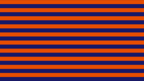
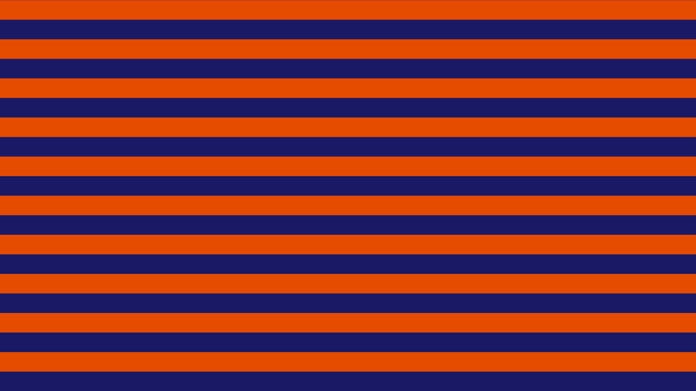

# linePattern  [](../images/linePattern.png)

**Function call:** `fn_linePattern (orientation, color1, color2, numberH, edgeSharpness);`  

Example with values: `fn_linePattern (uv.y, float3(0.1, 0.1, 0.4), float3(0.9, 0.3, 0.0), 20.0, 1000.0);`  
(Result [see image](../images/linePattern.png))
  
--- 
  
***Purpose:***  
Creates a pattern of a selectable number of symmetrical horizontal or vertical lines  
of alternating color or brightness or another RGB source.     
This can be a color, or a texture from a sampler.  
Adjustable edge softness of the squares.   
More details see the parameter descriptions.  

---
    
### Required global definitions and declarations:
*(add outside and above all shaders and functions):*
```` Code
//-----------------------------------------------------------------------------------------//
// Definitions and declarations
//-----------------------------------------------------------------------------------------//

#define PI  3.141592654
````
---

### Code (Example as a float3 RGB function without alpha):
```` Code
float3 fn_linePatternV (float orientation, float3 color1, float3 color2, float numberH, float edgeSharpness)
{ 
   orientation =  sin (orientation * PI * numberH ) * edgeSharpness / numberH;
   return lerp (color1, color2, clamp( orientation, -0.5, 0.5) + 0.5);
}
````   
When making code changes, note that `color1` and `color2` must have the same float type.

[Code description at the bottom of this page.](#code-description)


---
---

### Parameter Description  
  
   1. `orientation`:  
     Enter only one component of the texture coordinate variables used..  
     **Type: `float`**  
     Examples in case your texture coordinates are assigned to the variable `float2 uv`:
       - uv.y creates horizontal lines (thus vice versa, as it suggests y)  
       - uv.x creates vertical lines  
      

---

  
   2. `color1`:  
     Color of the first square at the top left. 
     **Type: `float3` (RGB)**  
       - This can be a color, or a texture from a sampler.

  
---

   3. `color2`:  
     Color of the squares next to `color1` squares. 
     **Type: `float3` (RGB)**  
       - This can be a color, or a texture from a sampler.  

       
---

   4. `numberH`:  
     The number of lines of both colors, counted only at the top or bottom edge of the frame.    
     **Type: `float`**  
     Value range: > +1   or < -1  
     **Illegal value is 0** (leads to division by 0)  


---

   5. `edgeSharpness`:  
     Edge sharpness of the squares  
     **Type: `float`**  
     Value range: > +1   or < -1  
     Values around 1000 and above result in relatively sharp edges for HD formats.  
     At 200 and below, the edge smoothness is clearly visible.  


---

### Return value:
   - The value of the parameter `color1` or `color2` (in the change of squares)  
   - **Type: float3** (same type as `color1` and `color2`)    
   - Value range: 0.0 to 1.0  

 
---
---

### Code description  

The code at the top of this page is compressed.  
For a better understanding, the uncompressed code is described here:
```` Code
float3 fn_linePatternV (float orientation, float3 color1, float3 color2, float numberH, float edgeSharpness)
{ 
   float mix =  sin (orientation * PI * numberH );
   mix *=  edgeSharpness / numberH;
   mix =  clamp( mix, -0.5, 0.5);      // range -0.5 +0.5
   mix += 0.5 ;                        // range 0 to 1
   return lerp (color1, color2, mix);
}
````
**Code description:**  
 
`mix =  sin (orientation * PI * numberH );` Creates a wave pattern ( value range from -1 to +1).

The following two lines of code increase the sharpness:
```` Code
x *=  edgeSharpness / numberH;
x =  clamp( x, -0.5, 0.5);   // range -0.5 +0.5`
````
` x += 0.5 ; ` Move to the normal range from 0 to 1  

`return lerp (color1, color2, mix);` Assignment to the set colors.  
If you only need black and white lines then you can simplify the code by returning the `mix` variable.  


---
---
### Screenshot  

