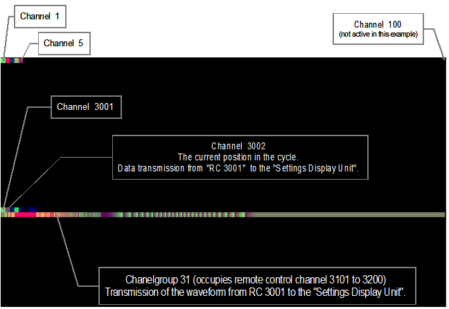

# Positioning the channels within the texture:

The remote control signals are encoded as color dots in a texture and transmitted on the remote control line.

  
#### Defining the position and dimensions of these small rectangles:
   - Number
      - *Horizontal*: 100 rectangles = 100 channels
      - *Vertical*: 50 lines of 100 channels each
      - *Total*: 5000 channels, each containing red, green, blue, and alpha channel
   - Dimensions:
      - *Horizontal*: 1% of the texture width
      - *Vertical*: 2% of the texture height

The top line: Channel 1 is at the top left, channel 100 is at the top right.  
The line below contains channel 101 on the left, and channel 200 on the right.  
We continued for the lines below.  

The lines are referred to here as channel groups.  
For the numbering of the channel groups, the first two digits of a four-digit channel numbering were used.  
Example:
   - Channel 3001 is in channel group 30
   - Channel 0003 is therefore in channel group 0
   
This does not apply to the currently blocked special channels 100, 200, 300 ... 1000, 1100 etc.

