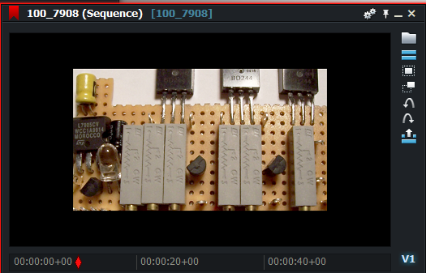

# Border sampler setting

### Example:
``` Code
sampler BorderSampler = sampler_state
{
   Texture = <In1>;
   AddressU = Border;
   AddressV = Border;
   MinFilter = Linear;
   MagFilter = Linear;
   MipFilter = Linear;
};
```

### The result:
  
[Just for comparison the original texture](images/Original.png)  


If the pixel you are looking for is outside the range of 0 to 1,  
then the Border setting causes the black color to be used.
