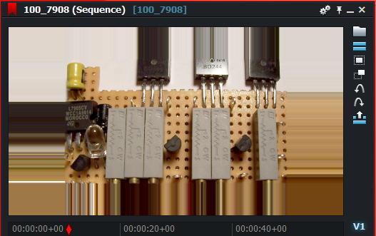

# Mirror sampler setting

### Example:
``` Code
sampler MirrorSampler = sampler_state
{
   Texture = <In1>;
   AddressU = Mirror;
   AddressV = Mirror;
   MinFilter = Linear;
   MagFilter = Linear;
   MipFilter = Linear;
};
```

### The result:
  
[Just for comparison the original texture](images/Original.png)  

