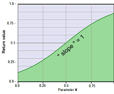
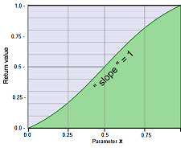

# S-Curves

|              [curve10S](curve10S.md)                    |     [curve12S](curve12S.md)                                   |
|:-------------------------------------------------------:|:-------------------------------------------------------------:|
|            **S-Curve**, 0 to 1                          |     **S-Curve**, 0 to 1                                       |
|    Adjustable slope based on tanh.                      |     Adjustable slope based on tanh.                           |
|                                                         | Starts and ends in any case with saturated levels. (0 or 1).  |
|              |   |

---

### More S-Curves:
 [S-curves that use the effect progress as a parameter.](../../Auto-synced_parameters/progress/README.md#s-curves)

