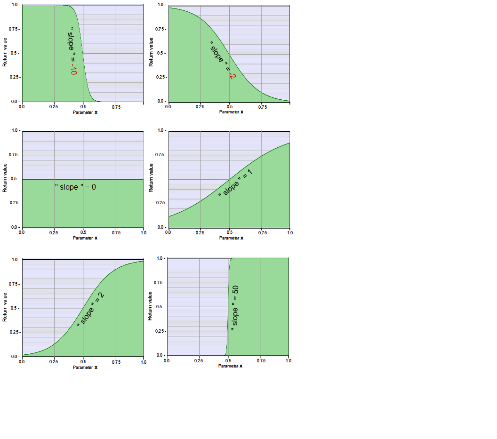

# curve10S  
and alternative code **[curve10bS](#curve10bS)**  
  
---
  
### curve10S  

S-curve with adjustable slope based on tanh.  
   
  
  ---
    
### Required global definitions and declarations:
*(add outside and above all shaders and functions):*
```` Code
//--------------------------------------------------------------//
// Definitions, declarations und macros
//--------------------------------------------------------------//

#define TANH(value)    tanh (clamp ( value , - 9.0 , 9.0))
````
This definition avoids critical values. See the [documentation of tanh.](../../Basics/Functions/Cg_standard_library/tanh/README.md#critical-parameter-values)  

---
  
### Code (Example as a function):  
```` Code
float fn_curve10S (float x, float slope)
{
   x = x * 2.0 - 1.0;
   x = TANH ( x * slope );
   return x / 2.0 + 0.5;
}
````
**Description:**  
`x = x * 2.0 - 1.0;` Rescaling of the presupposed value range (0 .. 1) to the range required for tanh from (-1 ... +1)  
`x = TANH ( x * slope );` S-curve, negative and positive values.  Note that TANH is the macro described above.  
`return x / 2.0 + 0.5;` Rescaling the range to 0 .. 1

---
  
### Parameter Description:
    
1. `x`: The value to which the S curve is to be applied.
   - **Type:** `float`, local   
   - **Value range**: Designed for a range of **0.0 to 1.0** , but all other values are allowed.
   - **Center** of the S-curve (return value identical to `x`): **0.5**   

2. `slope`: Slope in the center of the S-curve
   - **Type:** `float`, local   
   
---
  
### Return value: 
   - **Value range**: 0 to 1 or narrower  (see graphics above)
   - **Type:** `float`
   
   
   
---  
---  
---  
  

## Alternative code:
# curve10bS

Under the following conditions, the macro `TANH` can alternatively be replaced by `tanh` **(Macro not required)**:  
   The function is called with parameter values within the following range:  
   - `x` Maximum range 0 to 1  
   - `slope` Maximum range about -9 to +9  
   
### Code (Example as a function):  
```` Code
float fn_curve10bS (float x, float slope)
{
   x = x * 2.0 - 1.0;
   x = tanh ( x * slope );
   return x / 2.0 + 0.5;
}
````
    
### Parameter Description:
    
1. `x`: The value to which the S curve is to be applied.
   - **Type:** `float`, local   
   - **Permissible value range**: **0.0 to 1.0**
   - **Center** of the S-curve (return value identical to `x`): **0.5**   

2. `slope`: Slope in the center of the S-curve
   - **Type:** `float`, local  
   - **Permissible value range**: **-9 to +9**
   
---
  
### Return value: 
   - **Value range**: 0 to 1 or narrower  (see graphics above)
   - **Type:** `float` 

