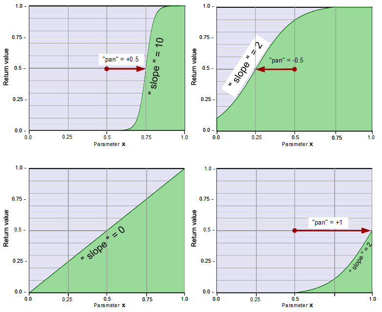

# curve14S


- S-curve with adjustable slope based on tanh. 
- Adjustable X-position of the S-curve.  
- In the case of a centred X-position of the S-curve, it is ensured that the curve begins and ends with saturated values (0 and 1).
   - For other x-positions this depends on the position, and the steepness of the curve (see images).

  
  
  ---
    
### Required global definitions and declarations:
*(add outside and above all shaders and functions):*
```` Code
//--------------------------------------------------------------//
// Definitions, declarations und macros
//--------------------------------------------------------------//

#define TANH(value)    tanh (clamp ( value , - 9.0 , 9.0))
````
This definition avoids critical values. See the [documentation of tanh.](../../Basics/Functions/Cg_standard_library/tanh/README.md#critical-parameter-values)  

---
  
### Code (Example as a function):  
```` Code
float fn_curve14S (float x, float slope, float pan)
{
   float x2 = (x * 2.0 - 1.0);
   float sCurve  = TANH ( slope * (x2- pan) );

   float refLevelA = abs (TANH (slope * -1.0));                    // Referenzpegel bei progress-Anfang  ,  -1.0 ist progress-Anfang
   float refLevelB = abs (TANH (slope));                           // Referenzpegel bei progress-Ende

   float levelCorrection1 = 1.0 / max(refLevelA, 1E-9);                   // Erforderliche umskalierung der S-Kurve auf den gewünschen Maximalwert abs 1 am Progress-Anfang
   float levelCorrection2 = 1.0 / max(refLevelB, 1E-9);                   // Erforderliche umskalierung der S-Kurve auf den gewünschen Maximalwert abs 1 am Progress-Ende

   sCurve *= min (levelCorrection1, levelCorrection2) ;
  
   sCurve = saturate (sCurve / 2.0 + 0.5);
   return slope < 0.4 ? lerp ( sCurve, x , (0.4 - slope) * 2.5) : sCurve;
}

````

**Description:**  
      
   - `float x2 = (x * 2.0 - 1.0);` Rescaling of the presupposed value range (0 .. 1) to the range required for tanh from (-1 ... +1)  
   - `float sCurve  = TANH ( slope * (x2- pan) );` S-curve, negative and positive values.  
      Note that TANH is the macro described above.  
   -  `float refLevelA = abs (TANH (slope * -1.0));`  Reference level at the start of the centered curve (x = -1.0).  
   -  `float refLevelB = abs (TANH (slope));`  
      - Functionally identical to the longer code: `float refLevelB  = abs (TANH (slope * 1.0));`  
      - Reference level at the end of the curve (x = 1.0).  
  - `float levelCorrection1 = 1.0 / max(refLevelA, 1E-9);`  
      Factor by which the S-curve must be scaled so that the centered S-curve starts with the value -1.   
      `max(refLevel, 1E-9)` prevents a division by zero.  
  - `float levelCorrection2 = 1.0 / max(refLevelB, 1E-9);`  
    Factor by which the S-curve must be scaled so that the centered S-curve ends with the value 1.  
  - `sCurve *= min (levelCorrection1, levelCorrection2) ;`  
    Rescaling the S-curve so that the value at the centered S-curve starts with the value 0, and with the value 1.  
  - `sCurve = saturate (sCurve / 2.0 + 0.5);` Rescaling the range to 0 .. 1  
    `saturate` prevents the start or end of a flat curve leaving the range from 0 to 1 at `pan` <> 0.  
  - `return slope < 0.4 ? lerp ( sCurve, x , (0.4 - slope) * 2.5) : sCurve;`  
    This code reduces mathematical inaccuracies when `slope` values are set close to 0.  
    At `slope` 0, the values of the variable `sCurve`, before rescaling, are a horizontal line with the value 0.  
    However, the previous code `sCurve *= min (levelCorrection1, levelCorrection2)`  
    tries to multiply the value 0 extremely to produce a curve (ramp) from -1 to +1.  
    Because this is impossible, the input value `x` is used instead:  
    With `slope` values of zero, `x` is used as the return value. 
    Input value and return value are therefore identical in this case.  
    With positive `slope` values of >=0.4 , the sCurve is used.  
    With `slope` 0.2 the values of the sCurve and `x` are mixed in equal proportions.  
    - `(0.4 - slope) * 2.5)` defines the mixing ratio.  
      - If `slope` has the value 0.4, then the formula results in the control value 1.0, 
      whereby `lerp` is used only the sCurve.  
       - If `slope` has the value 0.0, then the formula results in the control value 1.0, 
      whereby `lerp` will only use `x`, which is already flattened at this value so 
      that it is very similar to the input value `x`.  
       - Negative `slope` - values are not allowed.


---
  
### Parameter Description:
    
1. `x`: The value to which the S curve is to be applied.
   - **Type:** `float`, local   
   - **Value range**: Designed for a range of **0.0 to 1.0** , but all other values are allowed.
   - **Center of the S-curve** adjustable

2. `slope`: Slope in the center of the S-curve  
   - Negative values are **not** allowed.
   - **Type:** `float`, local   

3. `pan`: Changing the x-position of the S-curve
   - Centered when `pan` is set to 0
   - If `pan` = -1 is used, the center of the S-curve is moved to the left edge.
   - If `pan` = +1 is used, the center of the S-curve is moved to the right edge.
   
---
  
### Return value: 
   - **Value range**: maximum 0 to 1 (if pan = 0) 
   - **Type:** `float`

   